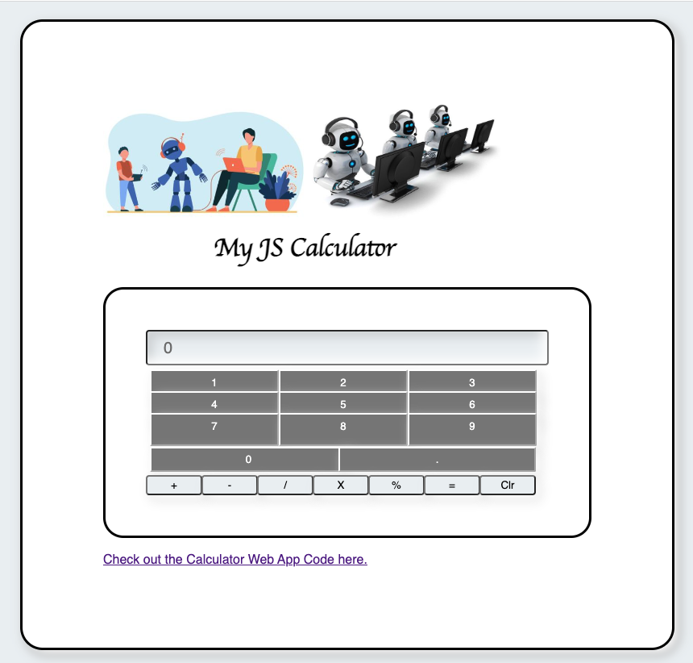

******************************
# My JavaScript Calculator Project
*******************************
This is a Calculator project using Javascript.
It does the following Math operations:
  1. Additon
  2. Substraction
  3. Division
  4. Multiplicaiton
  5. Percentage
Once the Math operation is completed, you can continue with the next operation or clear the screen

